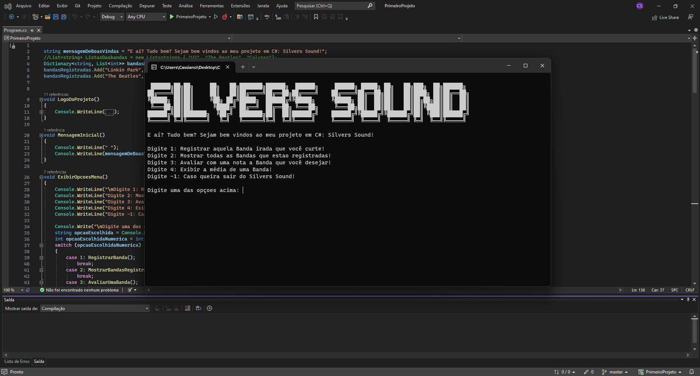

# 👨🏾‍💻 Meu primeiro projeto com CSharp | My first project with CSharp

## Descrição do Projeto | Project description. 🔡

- Aqui foi instalado e configurado o ambiente de desenvolvimento em diferentes sistemas operacionais, 
porém o que veio a ser utilizado de fato veio a ser o Microsoft Visual Studio no Windows.
- Foi criado um programa em C# com absorção e entendimento dos conceitos de tipagem forte.
- Foram explorados o ecossistema do C#, juntamento com a documentação e seus recursos úteis como o Stackoverflow e Office 2019.
- Criação de funções para mostrar o menu principal e registrar bandas em listas e dicionários, podendo também avaliar as bandas
inseridas no projeto e calcular as médias com base nos dados que foram registrados.

## Demonstração do Projeto | Project demonstration. 😄

## Linguagem utilizada | Language used. 🖥️
- ``C#``
